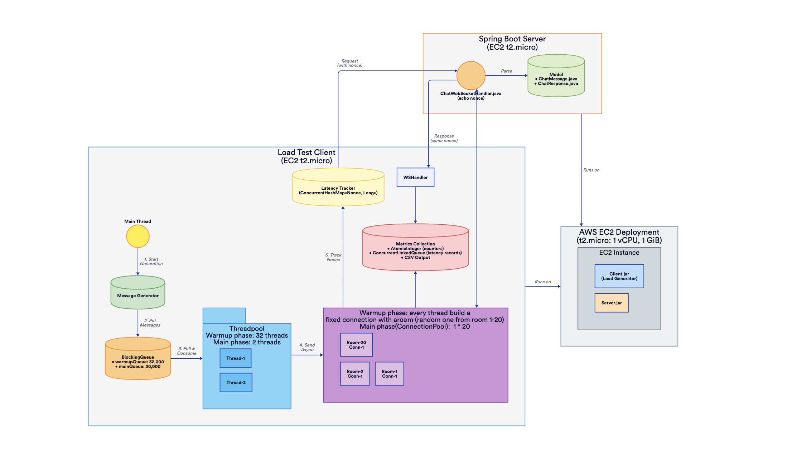
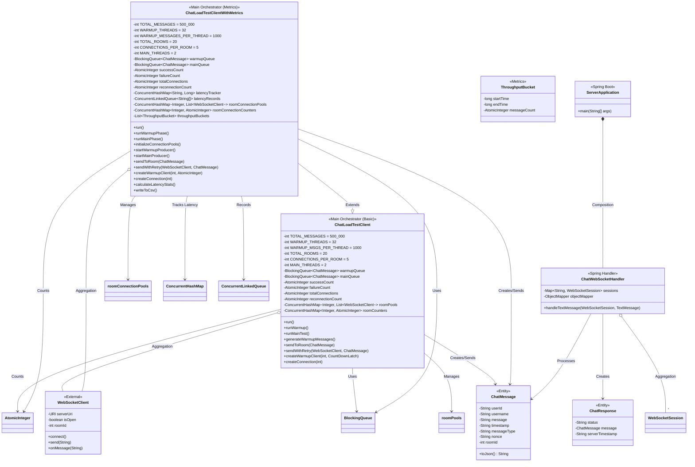
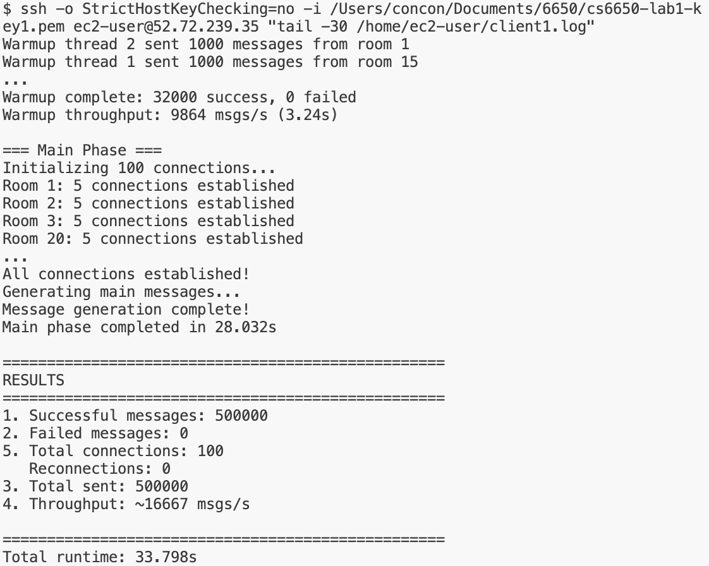
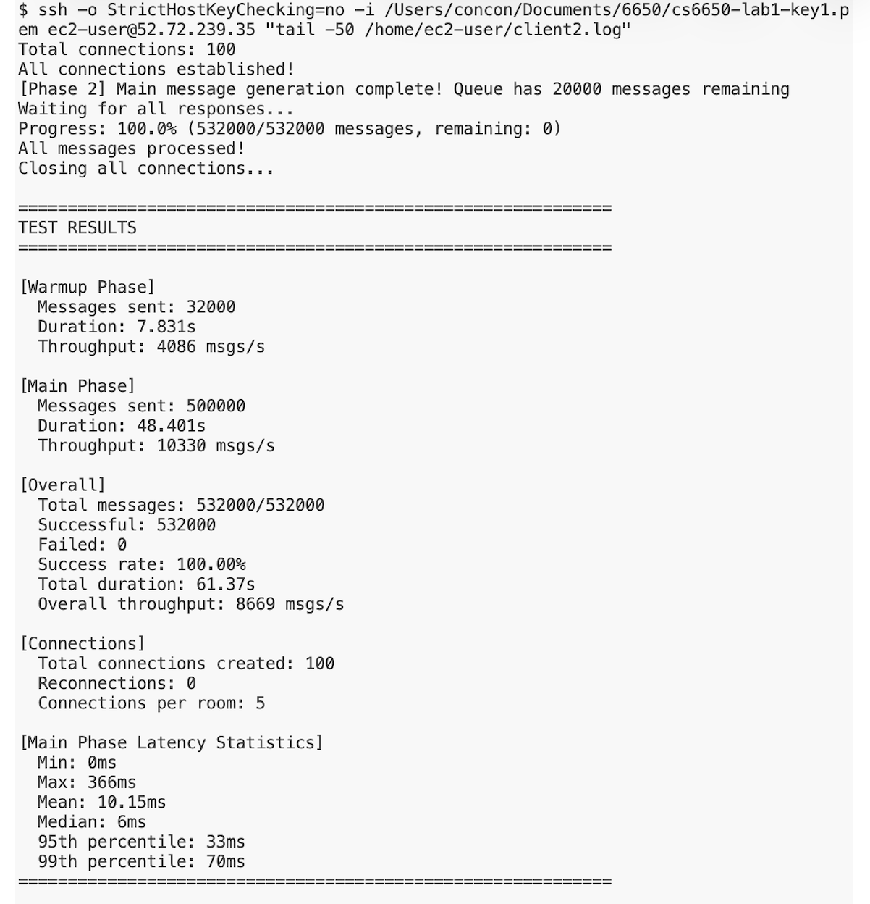
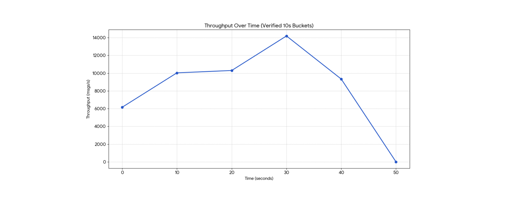
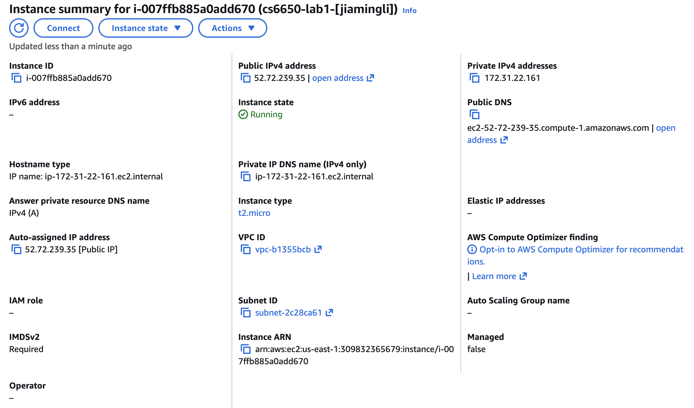

# 1. Git Repository URL
- `/server` - Server implementation with deployment instructions
- `/client-part1` - Basic load testing client
- `/client-part2` - Client with performance analysis
- `/results` - Test results and analysis
- Include README files with clear running instructions

# 2. Design Document
## Architecture diagram

## Major classes and their relationships

## Threading model explanation
Main thread, running `main()`.
**Warmup Phase**: one thread for message generation(put in `warmupQueue`, 32,000 capacity) and 32 threads where each thread creates a fixed connection with a random room(1-20) and sends 1,000 messages to this room.
**Main Phase** one thread for message generation(put in `mainQueue`, 20,000 capacity). Message queues buffer messages between generation and sending, ensuring smooth pipelining. Use 2 sender threads to send 500,000 messages as consider the overhead of t2.micro switching between threads.

## WebSocket connection management strategy
**Warmup Phase**: each thread creates a fixed connection with a random room(1-20).
**Main Phase**: use connection pool where 20 rooms each maintain 5 persistent connections (100 total), avoiding repeated TCP handshake overhead. The `ConnectionManager` handles connection lifecycle: `initializeConnectionPools()` creates connections per room, `round-robin` selection distributes load via `roomCounters`. All connections are properly closed via `closeAllConnections()` after testing.

## Little's Law calculations and predictions

# 3. Test Results
## Screenshot of Part 1

## Screenshot of Part 2

## Performance analysis charts

## Evidence of EC2 deployment (EC2 console screenshot)

