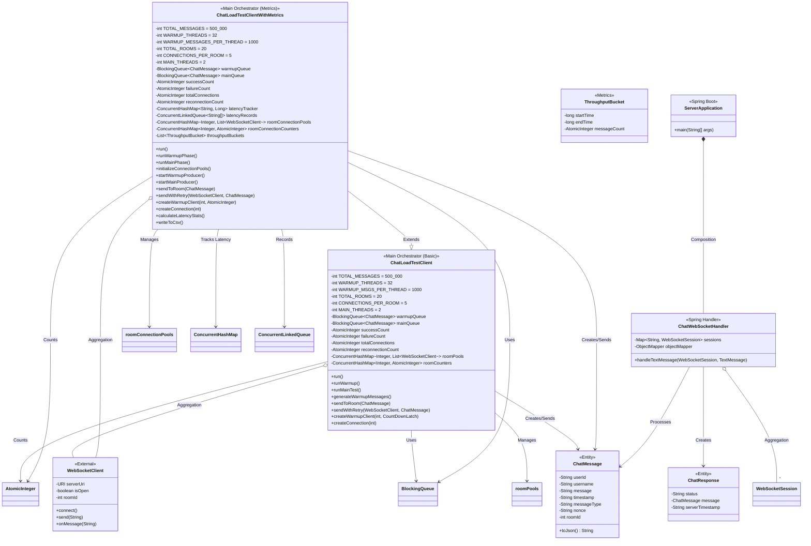
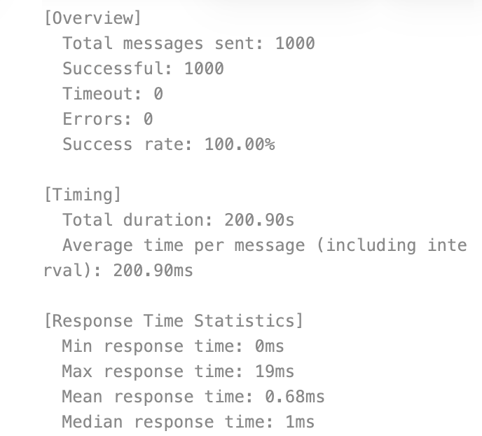
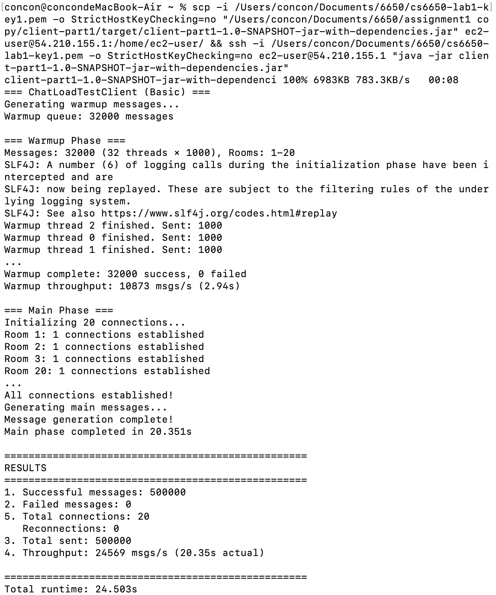
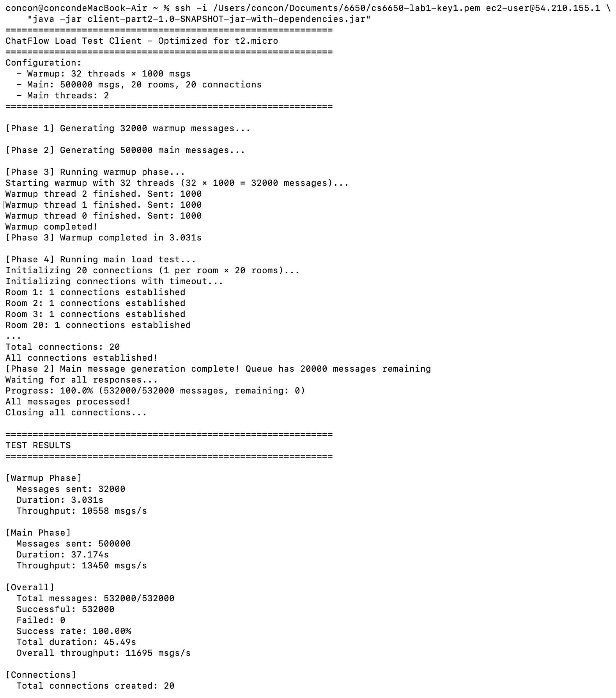
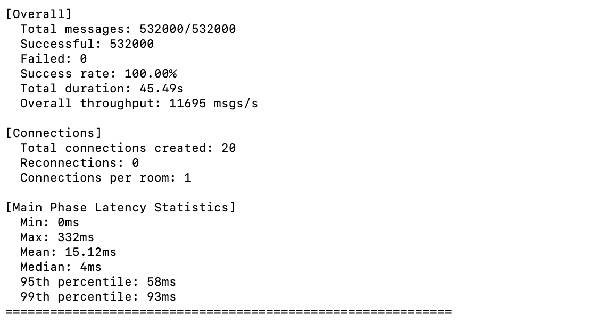

# 1. Git Repository URL
https://github.com/jiaming2li/CS6650_assignment1.git

# 2. Design Document
## Architecture diagram

## Major classes and their relationships

## Threading model explanation
Main thread, running `main()`.  

**Warmup Phase**: one thread for message generation(put in `warmupQueue`, 32,000 capacity) and 32 threads(threadpool) where each thread creates a fixed connection with a random room(1-20) and sends 1,000 messages to this room.  

**Main Phase** one thread for message generation(put in `mainQueue`, 20,000 capacity). Message queues buffer messages between generation and sending, ensuring smooth pipelining. Use 2 sender threads(threadpool) to send 500,000 messages as consider the overhead of t2.micro switching between threads. I tried 3/4/32 threads and can not achieve ideal throughput, showing that the bottleneck is 1 vCPU.

## WebSocket connection management strategy 

**Warmup Phase**: each thread creates a fixed connection with a random room(1-20).  

**Main Phase**: use connection pool where 20 rooms each maintain 1 persistent connections (20 total). Sender picks corresponding connection according to message's roomId and sends through the connection. I tried 2/3/5 connections per room and can not achieve ideal throughput. I assumed that CPU can not handle more concurrent messages.

## Little's Law calculations and predictions
  

I tested mean single message RTT(0.68ms), meaning the theoritical throughput is 20/0.68=29411. But as the cost of CPU context switching, lock contention, network queue/CPU limitation and extra data processing, the real throughput is a little bit lower than 29411(24000+ to 26000+). 

# 3. Test Results
## Screenshot of Part 1

## Screenshot of Part 2

## Performance analysis charts

## Evidence of EC2 deployment (EC2 console screenshot)

